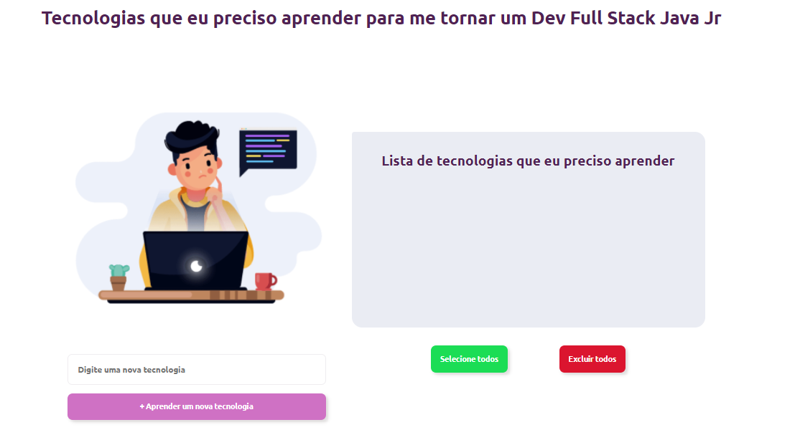

<h3 align="center">
   🔖 Faça a sua lista de tecnologias para se tornar um Dev Full Stack Java Jr <br/>
    <br><br>
</h3>


## 🔖 Informaçoes sobre a Lista <br/>

A <strong>Lista</strong> é feita com os conhecimentos que a pessoa juga ser necessário para se tornar um dev Full Stack Java Jr <br/>

## 🖼 Screenshot das telas da aplicação <br/>


<br/>


## 🚀 Tecnologias utilizadas <br/>
<br/>

<br>
<p align="left">

  <a href="https://developer.mozilla.org/pt-BR/docs/Web/HTML" target="_blank">
    
  </a>

  <a href="https://developer.mozilla.org/pt-BR/docs/Web/CSS" target="_blank">
    
  </a>
  <a
    href="https://developer.mozilla.org/en-US/docs/Web/JavaScript"
    target="_blank"
  >
    
  </a>
  
</p>

<br>
<br/>

### :memo: Funcionalidades: 
- poder adicionar e remover as tecnologias a ser aprendida
- poder marcar tecnologias como aprendida
- não pode adicionar um tecnologia vazia
- Um botão para marcar e outro para deletar todas as tecnologias
- opção de arrastar e soltar os itens

# 👷 Como rodar

```bash
# Clonar o repositório
git clone https://github.com/teteusAraujo/I-need-to-learn

# Entrar numa IDE de sua preferência 

# Executar o servidor ou usar um puglin que criar um servidor

```

## 🤔 Como contribuir <br/>

- Faça um fork desse repositório; <br/>
- Cria uma branch com a sua feature: `git checkout -b minha-feature`;<br/>
- Faça commit das suas alterações: `git commit -m 'feat: Minha nova feature'`; <br/>
- Faça push para a sua branch: `git push origin minha-feature`.<br/>
<br/>
Depois que o merge da sua pull request for feito, você pode deletar a sua branch. <br/>


## :mortar_board: Autores

<table align="center">
    <tr>
        <td align="center">
            <a href="https://github.com/teteusAraujo">
                
                <br />
                <sub><b>Mateus Araújo</b></sub>
            </a>
        </td>    
    </tr>
</table>
<h4 align="center">
   Feito com 💜 by  <a href="https://www.linkedin.com/in/mateusara%C3%BAjo/" target="_blank"> Mateus Araújo </a>
</h4>
</body>
</html>
